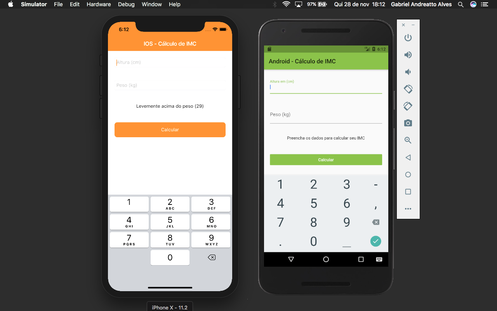

# imc_baltaio

A new basic Flutter project with diferent pages/layouts between Android and IOS platform.

# Getting Started

This project is a starting point for a Flutter application to Android eand IOS platform.
Creating layouts based on the different and distinct Android and IOS platform.
Each platform with its own model.

Using 'Bloc', it is possible to share business rules between different Android and IOS platforms.

# Dependencies:

flutter_masked_text
https://github.com/benhurott/flutter-masked-text
https://pub.dev/packages/flutter_masked_text

io 0.3.3
https://pub.dev/packages/io

# Simulators:

IOS: Use command+k to open keyboard when entering values.

-------------------------------------------------------------------------------------

A few resources to get you started if this is your first Flutter project:

- [Lab: Write your first Flutter app](https://flutter.dev/docs/get-started/codelab)
- [Cookbook: Useful Flutter samples](https://flutter.dev/docs/cookbook)

For help getting started with Flutter, view our
[online documentation](https://flutter.dev/docs), which offers tutorials,
samples, guidance on mobile development, and a full API reference.
